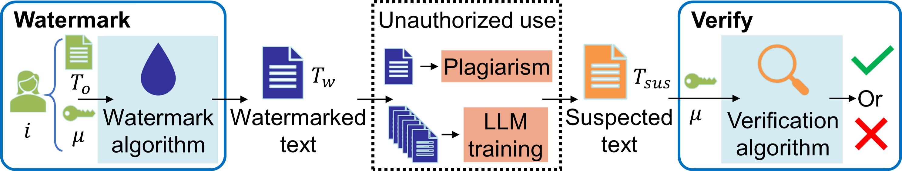
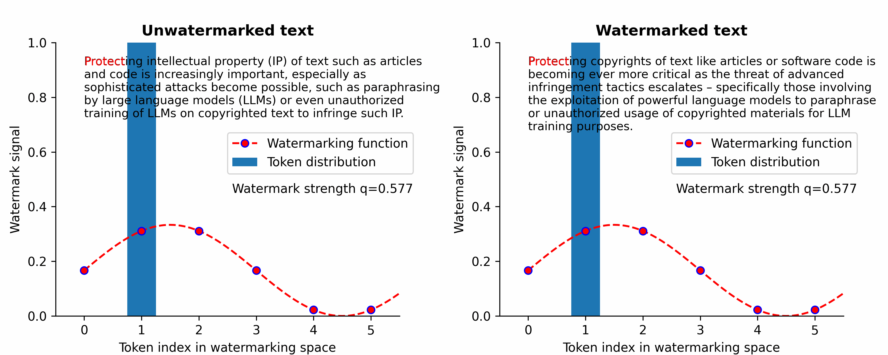

# Waterfall: Framework for Robust and Scalable Text Watermarking
Gregory Kang Ruey Lau*, Xinyuan Niu*, Hieu Dao, Jiangwei Chen, Chuan-Sheng Foo, Bryan Kian Hsiang Low

[ArXiv](https://arxiv.org/abs/2407.04411) | [Paper](https://arxiv.org/pdf/2407.04411)

## TL;DR: Training-free framework for text watermarking that is scalable, robust to LLM attacks, and applicable to original text of multiple types 



1. Watermark original text $T_o$ with watermark key $\mu$ → watermarked text $T_w$ with same semantic content

2. Adversaries try to claim IP by plagiarizing text (e.g. paraphrasing), or by using text to train their own LLMs without authorization

3. Clients can quickly verify whether a suspected text $T_sus$ contains the watermark and originated from $T_o$




# Abstract
Protecting intellectual property (IP) of text such as articles and code is increasingly important, especially as sophisticated attacks become possible, such as paraphrasing by large language models (LLMs) or even unauthorized training of LLMs on copyrighted text to infringe such IP. However, existing text watermarking methods are not robust enough against such attacks nor scalable to millions of users for practical implementation. In this paper, we propose Waterfall, the first training-free framework for robust and scalable text watermarking applicable across multiple text types (e.g., articles, code) and languages supportable by LLMs, for general text and LLM data provenance. Waterfall comprises several key innovations, such as being the first to use LLM as paraphrasers for watermarking along with a novel combination of techniques that are surprisingly effective in achieving robust verifiability and scalability. We empirically demonstrate that Waterfall achieves significantly better scalability, robust verifiability, and computational efficiency compared to SOTA article-text watermarking methods, and also showed how it could be directly applied to the watermarking of code.

# Run our code
To run our code, you need to install the required packages:
```
pip install -r requirements.txt
```

Use `watermark.py` to watermark a piece of text, and then verify the presence of the watermark in the watermarked text
```
python watermark.py
```

Additional arguments
```
python watermark.py \
  --T_o          "TEXT TO WATERMARK"            `# Original text to watermark` \
  --id           42                             `# Unique watermarking ID`     \
  --k_p          1                              `# Additional purtabation key` \
  --kappa        4                              `# Watermark strength`         \
  --model        meta-llama/Llama-2-13b-chat-hf `# Paraphrasing LLM`           \
  --watermark_fn fourier                        `# fourier/square watermark`   \
  --device       cuda                           `# Use cuda/cpu`
```

## BibTeX
```
@article{lau2024waterfall,
  title={Waterfall: Framework for Robust and Scalable Text Watermarking},
  author={Lau, Gregory Kang Ruey and Niu, Xinyuan and Dao, Hieu and Chen, Jiangwei and Foo, Chuan-Sheng and Low, Bryan Kian Hsiang},
  journal={arXiv preprint arXiv:2407.04411},
  year={2024}
}
```